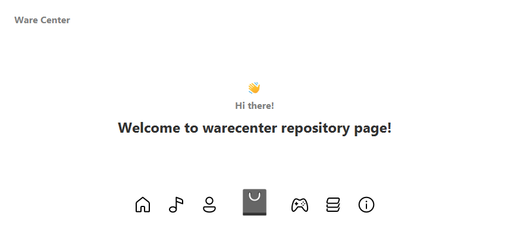

Hi there 👋

We are developing the most elegant application that will allow you to enjoy the content of the GuiseWare Team and its affiliated studios and communities. You will be able to play games from different developers, listen to music, watch various videos and even ambitious projects and dubbing created in the GuiseWare Team, and much more. This is not the whole range of possibilities. There are many more of them than you think.

# 📝 Note!

 

Both regular release versions, beta versions, and even development versions will be laid out here. You will also be able to receive deep support and assistance on using the Ware Center. There are many different features in each version, and they say that there will be a new interface in the development versions.

 

# 📌 When is the release date?

 

After the GuiseWare Expo, the release date will be known. At the GuiseWare Expo itself, they will talk directly about the Ware Center and related products and programs.

 

